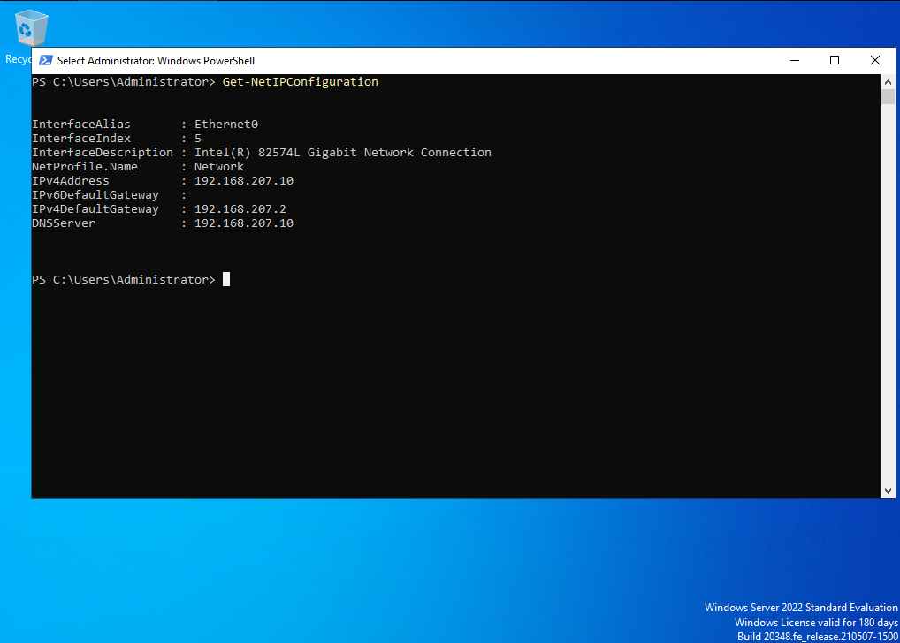

# Lab 00 — Domain Controller & AD Foundation

**Status:** In progress
**Scenario:** Standing up the `corp.canyonpeaktech.com` domain from a bare VM, before any Okta work begins.

## Objective

Provision a dedicated Windows Server 2022 VM, promote it to the first domain controller of a new forest, and lay down the OU structure and service account the rest of the series depends on. This is deliberately a **separate environment** from the home lab I already run day to day — Canyon Peak gets its own isolated forest so nothing here disturbs an environment I depend on.

Steps are written for the **Windows GUI** — Server Manager, ADUC, DNS Manager — since that's where this work actually gets done day to day, and it's the muscle memory the Okta Certified Professional performance exam expects. Each step also carries the PowerShell equivalent in a collapsible block, because a runbook that only works one way isn't much of a runbook.

## A note on the domain name

The AD domain is `corp.canyonpeaktech.com` — a subdomain of the public domain Canyon Peak owns — rather than something like `canyonpeak.local`. Microsoft has advised against `.local` for Active Directory for years: it's reserved for multicast DNS (mDNS/Bonjour), so it can collide with name resolution on any network running Apple devices or Linux hosts with Avahi, and no public CA will issue a certificate for it if you later need one. Delegating a subdomain of a domain you actually control is the current recommended pattern and handles split-brain DNS cleanly.

Staff still sign in as `first.last@canyonpeaktech.com` rather than the longer `@corp.canyonpeaktech.com`, using an alternative UPN suffix added in step 8. That keeps AD logon names identical to the email addresses and to the Okta usernames from Lab 01 — which matters, because Lab 02 matches AD accounts to existing Okta profiles by username.

## Prerequisites

- VMware Workstation (or Player) with ~60 GB free disk and 4–8 GB RAM to spare
- Windows Server 2022 evaluation ISO from the [Microsoft Evaluation Center](https://www.microsoft.com/en-us/evalcenter/evaluate-windows-server-2022) — 180-day eval, roughly 5 GB
- Around two hours; the OS install and the forest promotion are both slow

## Environment & technologies

- VMware Workstation — VM on the **NAT** network (VMnet8), isolated from the physical LAN
- Windows Server 2022 Standard, Desktop Experience
- Server Manager, Active Directory Users and Computers (ADUC), AD Domains and Trusts, DNS Manager
- Active Directory Domain Services (AD DS) and the DNS Server role

### Why NAT rather than bridged

The VM sits on VMware's NAT network instead of being bridged onto the physical LAN. Bridging would put a second domain controller — with its own DNS service — directly onto the same network as my existing home lab, which is a good way to get two DCs answering DNS queries for clients that didn't ask for it. NAT gives the VM its own subnet with outbound internet (needed by the Okta AD Agent in Lab 02) while keeping it away from anything else on the network.

---

## Steps

### 1. Create the VM

In VMware Workstation: **File → New Virtual Machine → Custom (advanced)**.

| Setting | Value |
|---|---|
| Installation source | **I will install the operating system later** |
| Guest OS | Microsoft Windows → Windows Server 2022 |
| VM name | `CANYONPEAK-DC01` |
| Firmware | UEFI |
| Processors | 2 cores |
| Memory | 4096 MB minimum, 8192 MB if you can spare it |
| Network | **NAT** |
| Disk | 60 GB, *Store virtual disk as a single file* |

Choosing "install the OS later" matters — it skips VMware Easy Install, which otherwise auto-creates an account and picks an edition for you, and you want to make both of those choices deliberately.

After the wizard finishes: **Edit virtual machine settings → CD/DVD → Use ISO image file**, and point it at the Server 2022 ISO.

### 2. Install Windows Server 2022

Power on and press a key when prompted to boot from the ISO.

1. Language/keyboard → **Next** → **Install now**
2. Edition: **Windows Server 2022 Standard (Desktop Experience)** — the plain "Standard" entry is Server Core, which has no GUI at all. Desktop Experience is what the rest of this lab assumes.
3. Accept the license terms → **Custom: Install Windows only**
4. Select the 60 GB disk → **Next**, then wait out the install and reboot
5. Set the local Administrator password when prompted. Record it — after promotion this becomes the *domain* Administrator account.

Then install VMware Tools (**VM → Install VMware Tools**, run setup from the mounted drive) for proper display scaling and mouse integration, and reboot.

📸 *Screenshot: Server Manager on first boot, showing the Desktop Experience install.*

### 3. Find the NAT subnet

VMware assigns a random subnet to VMnet8 per installation, so check yours rather than assuming.

On the **host**: **Edit → Virtual Network Editor** (click *Change Settings* for admin rights) → select **VMnet8 (NAT)**. Note the subnet address, then open **NAT Settings** to see the gateway IP.

Typical layout, with `x` being your subnet's third octet:

| Address | Role |
|---|---|
| `192.168.x.1` | Host's virtual adapter |
| `192.168.x.2` | NAT gateway — this is the VM's default gateway |
| `192.168.x.128` – `.254` | VMware's DHCP pool |

Anything from `.3` to `.127` is outside the DHCP pool and safe to use statically. This lab uses **`.10`**. Write your actual subnet down — you'll need it again in Lab 02 when pointing the Okta AD Agent at this machine.

<details>
<summary>PowerShell equivalent (run on the host)</summary>

```powershell
$p = ((Get-NetIPAddress -InterfaceAlias "*VMnet8*" -AddressFamily IPv4 |
       Where-Object { $_.IPAddress -notlike '169.254.*' } | Select-Object -First 1).IPAddress) -replace '\.\d+$',''
"Subnet: $p.0/24   |   DC static: $p.10   |   Gateway: $p.2"
```
</details>

### 4. Set a static IP and hostname

A domain controller needs a stable address — its own DNS records point at it, and clients that can't resolve it can't log in.

**Static IP.** In the guest: **Control Panel → Network and Sharing Center → Change adapter settings**. Right-click **Ethernet0 → Properties → Internet Protocol Version 4 (TCP/IPv4) → Properties**, then choose *Use the following IP address*:

| Field | Value |
|---|---|
| IP address | `192.168.x.10` |
| Subnet mask | `255.255.255.0` |
| Default gateway | `192.168.x.2` |
| Preferred DNS server | `192.168.x.10` — **its own address** |

That last field is the one people get wrong. A domain controller must be authoritative for its own zone, so it points DNS at itself rather than at a router or a public resolver.

**Hostname.** **Server Manager → Local Server → Computer name** → *Change* → set to `CANYONPEAK-DC01` → OK, then reboot when prompted.

<details>
<summary>PowerShell equivalent (run in the guest)</summary>

```powershell
Get-NetIPConfiguration    # confirm the adapter name, usually "Ethernet0"

Set-NetIPInterface   -InterfaceAlias "Ethernet0" -Dhcp Disabled
New-NetIPAddress     -InterfaceAlias "Ethernet0" -IPAddress 192.168.x.10 -PrefixLength 24 -DefaultGateway 192.168.x.2
Set-DnsClientServerAddress -InterfaceAlias "Ethernet0" -ServerAddresses 192.168.x.10

Rename-Computer -NewName "CANYONPEAK-DC01" -Restart
```
</details>

Name resolution will fail at this point — DNS now points at a machine that isn't running a DNS server yet. That's expected; it starts working in step 8. Test connectivity by IP for now (`ping 192.168.x.2`), not by name.



### 5. Install the AD DS role

**Server Manager → Manage → Add Roles and Features**.

1. *Before you begin* → **Next**
2. Installation type: **Role-based or feature-based installation** → **Next**
3. Server selection: `CANYONPEAK-DC01` is already highlighted → **Next**
4. Server roles: tick **Active Directory Domain Services**. A dialog offers the required management tools — click **Add Features**. → **Next**
5. Features → **Next** → AD DS info page → **Next**
6. **Install**

This installs the role only. The machine is not a domain controller until you promote it in the next step.

<details>
<summary>PowerShell equivalent</summary>

```powershell
Install-WindowsFeature AD-Domain-Services -IncludeManagementTools
```
</details>

### 6. Promote to a new forest

When the role install finishes, Server Manager shows a yellow warning flag in the top bar. Click it → **Promote this server to a domain controller**.

1. **Deployment Configuration** → *Add a new forest* → Root domain name: `corp.canyonpeaktech.com`
2. **Domain Controller Options**
   - Forest and domain functional level: **Windows Server 2016** (the default, and fine here)
   - Leave **DNS server** and **Global Catalog** ticked — this is the first DC in the forest, it needs both
   - Set the **DSRM password**
3. **DNS Options** — a warning about a delegation for the parent zone not being created. Expected and safe to ignore: there is no real `canyonpeaktech.com` parent zone to delegate from. → **Next**
4. **Additional Options** — NetBIOS name auto-fills as `CANYONPEAK`. → **Next**
5. **Paths**, **Review Options** → **Next**
6. **Prerequisites Check** → warnings are normal, errors are not → **Install**

The VM reboots itself when promotion completes. This takes several minutes.

**About that DSRM password:** Directory Services Restore Mode is a break-glass credential for booting the DC into recovery when the domain itself is broken. Give it its own password, distinct from the Administrator account, and record it somewhere you'll still be able to reach if this machine is down.

<details>
<summary>PowerShell equivalent</summary>

```powershell
Install-ADDSForest `
    -DomainName "corp.canyonpeaktech.com" `
    -DomainNetbiosName "CANYONPEAK" `
    -InstallDns `
    -SafeModeAdministratorPassword (Read-Host -AsSecureString "DSRM password") `
    -Force
```

`Read-Host` rather than an inline password keeps it out of PowerShell history and out of any screenshot.
</details>

📸 *Screenshot: the promotion wizard's Deployment Configuration page, and the sign-in screen afterwards showing `CANYONPEAK\Administrator`.*

### 7. Validate the forest before building on it

Don't move on until this is clean — every later lab assumes a healthy domain.

**In the GUI:** Server Manager now lists **AD DS** and **DNS** in the left pane, both with green status. Open **Tools → Active Directory Users and Computers** and confirm `corp.canyonpeaktech.com` appears as the root with the default containers beneath it.

**Then run `dcdiag`**, which has no GUI equivalent and is the real test:

```powershell
dcdiag /q
Get-ADDomain | Select-Object DNSRoot, NetBIOSName, DomainMode
Get-Service ADWS, DNS, Netlogon, NTDS | Select-Object Name, Status
```

`dcdiag /q` only reports failures, so **no output is a pass**. All four services should show Running.

📸 *Screenshot: ADUC showing the new domain, and `dcdiag /q` returning clean.*

### 8. Fix DNS forwarding, then add the UPN suffix

**Forwarders first.** The DC resolves its own domain now, but external lookups may not work — and in Lab 02 the Okta AD Agent has to reach Okta over the internet. Catching this now avoids a confusing failure later.

**Server Manager → Tools → DNS** → right-click `CANYONPEAK-DC01` → **Properties → Forwarders tab → Edit** → add `1.1.1.1` and `8.8.8.8` → **OK**.

Then confirm from a command prompt:

```powershell
Resolve-DnsName okta.com     # must succeed before starting Lab 02
```

**Then the alternative UPN suffix.** By default every account's UPN would be `first.last@corp.canyonpeaktech.com`, but staff email — and the Okta usernames created in Lab 01 — use the shorter `@canyonpeaktech.com`.

**Server Manager → Tools → Active Directory Domains and Trusts** → right-click **Active Directory Domains and Trusts** at the very top of the left pane (not the domain itself) → **Properties → UPN Suffixes tab** → type `canyonpeaktech.com` → **Add** → **OK**.

Once registered, `canyonpeaktech.com` appears in the UPN drop-down when you create users in ADUC. Skip this and AD logon names won't match the Okta usernames, so the account matching in Lab 02 will fail.

<details>
<summary>PowerShell equivalent</summary>

```powershell
Set-DnsServerForwarder -IPAddress 1.1.1.1, 8.8.8.8
Set-ADForest -Identity (Get-ADForest) -UPNSuffixes @{Add="canyonpeaktech.com"}
Get-ADForest | Select-Object -ExpandProperty UPNSuffixes
```
</details>

📸 *Screenshot: the Forwarders tab, and the UPN Suffixes tab showing `canyonpeaktech.com`.*

### 9. Build the base OU structure

**Server Manager → Tools → Active Directory Users and Computers.**

Right-click the domain `corp.canyonpeaktech.com` → **New → Organizational Unit**. Create three, leaving *Protect container from accidental deletion* ticked:

- `CanyonPeak-Users`
- `CanyonPeak-Groups`
- `CanyonPeak-Disabled`

These are what Labs 02–06 expect. Scoping the Okta AD Agent to just these in Lab 02 means the sync never touches built-in containers.

<details>
<summary>PowerShell equivalent</summary>

```powershell
$base = "DC=corp,DC=canyonpeaktech,DC=com"
New-ADOrganizationalUnit -Name "CanyonPeak-Users"    -Path $base
New-ADOrganizationalUnit -Name "CanyonPeak-Groups"   -Path $base
New-ADOrganizationalUnit -Name "CanyonPeak-Disabled" -Path $base
```
</details>

📸 *Screenshot: the three OUs in the ADUC tree.*

### 10. Create a delegated service account

The Lab 06 automation scripts need rights to create, modify, disable, and move AD objects. Running them as Domain Admin would work and would also be exactly the habit an IAM role is supposed to break — so this account gets rights over the three lab OUs and nothing else.

**Create the account.** In ADUC, right-click the domain → **New → User**:

| Field | Value |
|---|---|
| Full name | `svc-labautomation` |
| User logon name | `svc-labautomation` @ `corp.canyonpeaktech.com` |

On the password page: untick *User must change password at next logon*, tick **Password never expires**. (A lab convenience — production would use a Group Managed Service Account instead.)

**Delegate control.** For each of the three OUs, right-click it → **Delegate Control** → **Next** → **Add** → `svc-labautomation` → **Next** → *Create a custom task to delegate* → **Next** → *This folder, existing objects in this folder, and creation of new objects in this folder* → **Next** → tick **Full Control** → **Next** → **Finish**.

Repeat for `CanyonPeak-Users`, `CanyonPeak-Groups`, and `CanyonPeak-Disabled`.

**Confirm it isn't privileged.** Open the account's **Member Of** tab — it should list only *Domain Users*. If `Domain Admins` is there, the delegation exercise was pointless.

<details>
<summary>PowerShell equivalent</summary>

```powershell
New-ADUser -Name "svc-labautomation" -SamAccountName "svc-labautomation" `
    -UserPrincipalName "svc-labautomation@corp.canyonpeaktech.com" `
    -Path "DC=corp,DC=canyonpeaktech,DC=com" `
    -AccountPassword (Read-Host -AsSecureString "Service account password") `
    -PasswordNeverExpires $true -Enabled $true

foreach ($ou in "CanyonPeak-Users","CanyonPeak-Groups","CanyonPeak-Disabled") {
    dsacls "OU=$ou,DC=corp,DC=canyonpeaktech,DC=com" /I:T /G "CANYONPEAK\svc-labautomation:GA"
}

Get-ADUser svc-labautomation -Properties MemberOf | Select-Object -ExpandProperty MemberOf
```
</details>

📸 *Screenshot: the Delegation of Control wizard's permissions page, and the account's Member Of tab showing only Domain Users.*

### 11. Snapshot the VM

With the forest, DNS, UPN suffix, OUs, and service account all verified: **VM → Snapshot → Take Snapshot**, named `post-promotion-baseline`.

If a later lab goes sideways, this is a two-minute recovery instead of rebuilding the domain. Worth noting the caveat, though: rolling a domain controller back from a snapshot is only safe here because this is a single-DC lab forest. In a multi-DC environment, restoring a DC snapshot risks USN rollback and needs a proper authoritative restore instead.

---

## Verification

- [ ] Server Manager shows AD DS and DNS with green status
- [ ] ADUC opens on `corp.canyonpeaktech.com`
- [ ] `dcdiag /q` produces no output
- [ ] AD DS, DNS, Netlogon, and ADWS are all Running
- [ ] `Resolve-DnsName okta.com` resolves — the Okta AD Agent depends on this in Lab 02
- [ ] AD Domains and Trusts lists `canyonpeaktech.com` as a UPN suffix
- [ ] `CanyonPeak-Users`, `CanyonPeak-Groups`, and `CanyonPeak-Disabled` exist
- [ ] `svc-labautomation` has delegated rights on those three OUs and is a member of Domain Users only
- [ ] Snapshot `post-promotion-baseline` exists

## Notes

_(fill in as completed — VMware networking quirks, DNS resolution issues, anything that didn't go to plan)_

## Key takeaways

_(fill in once complete)_

---

[Series overview](../..) | [Lab 01 — Tenant Setup & Configuration ➡](../01-tenant-setup)
