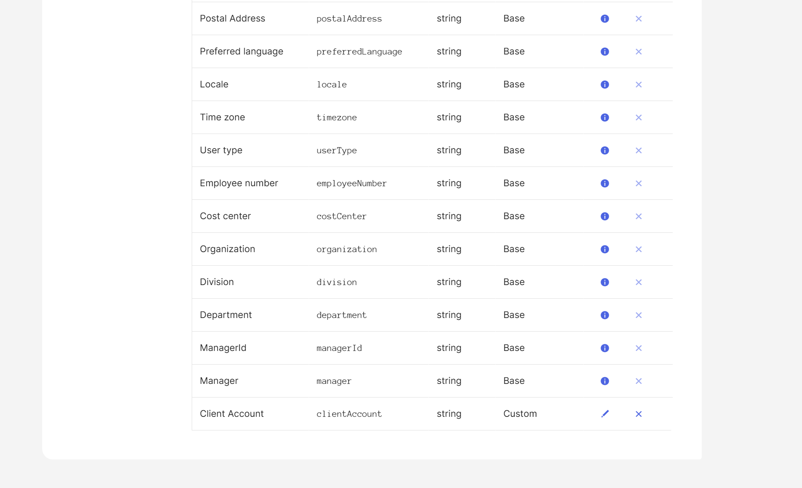
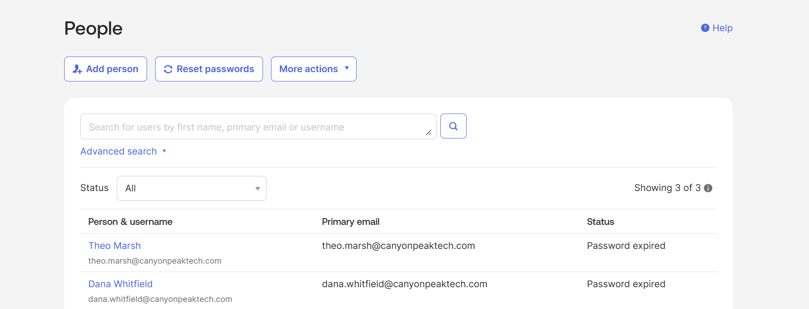
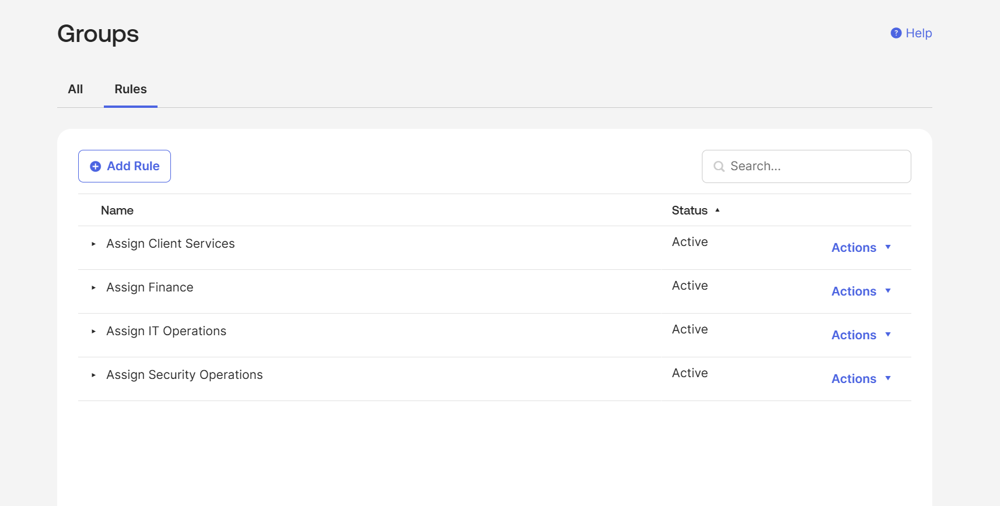

# Lab 01 — Tenant Setup & Configuration

**Status:** Not started
**Scenario:** Standing up the Canyon Peak Technologies Okta tenant and its initial identity foundation.

## Objective

Build a production-shaped Okta org from an empty tenant: organization profile, branding, a custom attribute schema, department groups with automated membership, and baseline security policy.

**A note on who gets created here.** Canyon Peak's employees live in Active Directory and arrive in Okta via directory sync in Lab 02 — creating them by hand here only to match them up later would be duplicated work that no real deployment does. What this lab creates instead are the accounts that genuinely *should* be Okta-native: contractors who were never in the corporate directory and never will be.

That mirrors how real tenants actually look. Almost every Okta org carries a mix — directory-sourced employees alongside native accounts for contractors, vendors, and break-glass admins deliberately kept independent of on-prem infrastructure. Being able to explain which identities belong to which source, and why, is a more interesting thing to know than either model alone.

This lab is entirely in the Okta Admin Console, so it's all GUI. That's not a compromise: the Okta Certified Professional exam is performance-based in this same console, so the clicking *is* the practice. Everything below can also be done through the Okta API or Terraform, which is how it would be managed at scale — see Key takeaways.

## Prerequisites

- Lab 00 complete (the domain controller isn't touched until Lab 02, but the labs build in order)
- An email address you can receive mail at, for the Okta org signup

## Environment & technologies

- Okta Identity Engine — Integrator Free Plan
- Okta Admin Console, Universal Directory, Profile Editor
- Okta Group Rules (Okta Expression Language)
- Okta Authentication Policies, Global Session Policy, Authenticator Enrollment Policy

### Watch the user budget

The Integrator Free Plan allows **10 active users**, and the series runs right up to that line:

| | Added | Running total |
|---|---|---|
| Your admin account | 1 | 1 |
| Lab 01 — Okta-native contractors | 2 | 3 |
| Lab 02 — AD-sourced staff | 4 | 7 |
| Lab 02 — throwaway JIT test account | 1 | 8 |
| Lab 03 — two role-based hires | 2 | 10 |
| Lab 03 — leaver offboarded | −1 | 9 |
| Lab 06 — Sam Okafor, then the batch | +1 / ±0 | 10 |

Deactivated users don't count against the cap, which is the only reason this fits — the leaver exercises in Labs 03 and 06 hand headroom back exactly when it's needed. Don't create spare test accounts casually, and deactivate rather than delete when a lab is done with someone.

Also worth knowing: an Integrator org deactivates if nobody signs in for 180 consecutive days. Not a concern mid-series, but don't be surprised if you come back to this in a year.

---

## Steps

### 1. Create the Okta org

Sign up for an Integrator Free Plan org at [developer.okta.com](https://developer.okta.com/signup/). You'll get an org URL of the form `https://dev-XXXXXXXX.okta.com` and an activation email.

Activate the account, sign in, and **enable MFA on your own admin account immediately** if you aren't prompted to. It's the keys to the entire tenant, and every later lab assumes you still have access to it.

Record the org URL, admin email, and admin password in your credentials file — outside the repo.

### 2. Organization profile

**Settings → Account → Organization Contact → Edit.**

| Field | Value |
|---|---|
| Company name | Canyon Peak Technologies |
| Address | 400 W Canyon Ridge Dr |
| City / State / Zip | Salt Lake City, UT 84101 |
| Country | United States |

These values appear in Okta-generated emails and in the audit trail, which is why it's worth setting before anything else exists to be audited.

### 3. Branding

**Edit the existing default brand — do not create a new one.** This is the trap in this step, and it's worth understanding rather than just working around.

Okta ties each brand to a domain. Your org's default subdomain (`dev-XXXXXXXX.okta.com`) is permanently served by the built-in **subdomain brand**, and a brand you create fresh has no domain to be served from until you map it to a *custom* domain. So "Create Brand" produces something real that simply never appears anywhere — you sign out, and the page is still stock Okta.

**Customizations → Brands** → open the brand already listed against your org subdomain.

On the **Theme** tab set a primary colour — `#2F5D50`, a muted canyon green, reads as deliberate rather than default. Upload a logo and favicon if you have them; a plain wordmark is fine.

On the **Pages** tab, open **Sign-In Page → Configure**, choose the solid background option, then **Save and Publish**. Publishing is a separate action from saving, and a saved-but-unpublished draft won't appear either. Repeat for the **End-User Dashboard** and **Error Pages**.

Then sign out, load your org URL, and hard-refresh (`Ctrl+Shift+R`) — sign-in page assets cache aggressively, so a stale page is the second reason branding appears not to have worked.

The subdomain brand accepts logos, colours, and page backgrounds but not custom HTML. Full customisation — custom sign-in page code, branded error pages — requires a custom domain, which is one of the more concrete arguments for setting one up.

📸 *Screenshot: the branded Canyon Peak sign-in page.*

### 4. Review the profile schema, then extend it

Do this **before** creating users, so every field exists to be populated at creation rather than needing a second pass.

**Read what's already there first.** Open **Directory → Profile Editor → User (default)**. Okta ships 31 base attributes modelled on the SCIM core schema (RFC 7643), and that already covers far more than most people expect — including `department`, `title`, `costCenter`, `organization`, `division`, `employeeNumber`, `userType`, and `managerId`.

Try to add `department` and Okta rejects it outright:

> Property name must be unique within profile. Property department is already present.

That's the lesson worth taking from this step. Reaching for a custom attribute before checking the base schema is how directories accumulate `dept`, `department_name`, and `Department` alongside the real one — and every one of those needs mapping, maintaining, and reconciling forever. Read the schema before you extend it.

**So use the built-ins.** `department` drives the group rules in step 7 and is the attribute that has to map cleanly from Active Directory in Lab 02. `title` and `costCenter` are populated because a real directory carries more than the minimum.

**Then add one attribute that genuinely doesn't exist.** Canyon Peak is an MSP, and which client an employee supports isn't a SCIM concept:

**Add Attribute:**

| Field | Value |
|---|---|
| Data type | string |
| Display name | Client Account |
| Variable name | `clientAccount` |
| Description | Primary client account this employee supports |
| User permission | Read-Only |

That's a legitimate schema extension — organization-specific data with no standard equivalent — and it gives you the Profile Editor practice the exam expects without polluting the directory with a duplicate.

### 5. Create the Okta-native contractors

**Directory → People → Add Person**, twice. These two are external contractors engaged by Canyon Peak — they have no Active Directory account and never will, which is precisely why they're created natively here.

| First | Last | Username / email | Department | Job Title | Cost Center | Client Account |
|---|---|---|---|---|---|---|
| Dana | Whitfield | dana.whitfield@canyonpeaktech.com | Security Operations | Contract Security Auditor | CC-9001 | Internal |
| Theo | Marsh | theo.marsh@canyonpeaktech.com | Client Services | Contract Field Technician | CC-9002 | Wasatch Medical Group |

For each: tick **I will set password**, set a temporary password, and tick **User must change password on first login**. Record the temporary passwords in your credentials file.

The `CC-90xx` cost centre range is deliberate — contractors bill differently from staff, and having that visible in the directory is the sort of detail that makes an attribute worth carrying.

`clientAccount` appears further down the Add Person form once you've created it in step 4. If it doesn't, you've likely added it to a profile other than **User (default)**.

Alex Rivera, Priya Nair, Marcus Webb, and Jordan Lee are Canyon Peak's actual employees. They arrive from Active Directory in Lab 02 — don't create them here.

### 6. Create groups

**Directory → Groups → Add Group**, six times:

| Group | Purpose |
|---|---|
| `Canyon Peak Contractors` | The Okta-native population. Policy target for this lab. |
| `Canyon Peak Employees` | The AD-sourced population. Empty until Lab 02 — create it now so the structure is in place. |
| `IT Operations` | Department groups. Two will be empty until Lab 02. |
| `Security Operations` | |
| `Client Services` | |
| `Finance` | |

Then open **Canyon Peak Contractors → People → Assign People** and add Dana and Theo. This one stays manual, because "is a contractor" isn't derivable from a profile attribute — it's a statement about the employment relationship, and manual assignment is the honest way to model it. The department groups get automated next.

### 7. Group rules

This is the interesting part of the lab. Rather than assigning department groups by hand, let Okta do it from the `department` attribute.

**Directory → Groups → Rules tab → Add Rule.**

| Rule name | Condition | Assign to |
|---|---|---|
| Assign IT Operations | User Attribute `department` equals `IT Operations` | IT Operations |
| Assign Security Operations | User Attribute `department` equals `Security Operations` | Security Operations |
| Assign Client Services | User Attribute `department` equals `Client Services` | Client Services |
| Assign Finance | User Attribute `department` equals `Finance` | Finance |

Save each, then **Actions → Activate** — a rule does nothing until it's activated, which is easy to miss.

Only two of these match anyone right now: Dana lands in Security Operations, Theo in Client Services. The IT Operations and Finance rules sit dormant with nothing to catch. Build them anyway — in Lab 02 the AD-sourced staff arrive carrying `department` values, and these rules will assign them with no further work. Watching a rule you wrote days earlier fire on identities from an entirely different source is the clearest demonstration there is that attribute-driven access doesn't care where an identity came from.

**Prove it works rather than assuming.** Edit Theo Marsh's profile, change `department` from `Client Services` to `Finance`, save, and watch him leave one group and join the other without you touching group membership. Then change it back.

### 8. Baseline authentication policy

**Security → Authentication Policies** → add a policy named `Standard Access Policy`, described as *Baseline access requirements for Canyon Peak*.

Note the choice of policy type here. **App Sign-In** is what you want — it governs access to applications, and you can create as many as you need. The **Okta Account Management Policy** listed alongside it is a different animal: a single built-in, non-deletable policy governing self-service operations — authenticator enrollment and unenrollment, password recovery, and account unlock. It can't be assigned to apps at all. Worth knowing it exists, because tightening app sign-in while leaving account recovery satisfiable by an emailed link is a genuinely common gap.

Every new policy ships with a **Catch-all Rule** you can't delete. It sits at the bottom, matches anything no earlier rule caught, and defines the floor.

**Add one rule above it:**

| Field | Value |
|---|---|
| Rule name | `Contractors require MFA` |
| IF User's group membership includes | `Canyon Peak Contractors` |
| AND User's IP is | Any IP |
| THEN Access is | Allowed after successful authentication |
| AND User must authenticate with | Password + Another factor |
| AND Possession factor constraints are | *leave unchecked* |

Then confirm the **Catch-all Rule** is set to `Password` — that's everyone else.

**On possession factor constraints:** these narrow *which* possession factors satisfy the rule. Ticking **phishing resistant** restricts it to FIDO2/WebAuthn, passkeys, smart cards, and FastPass in phishing-resistant mode — Okta Verify push and TOTP don't qualify. Since nobody has enrolled anything yet and step 10 sets contractors up with Okta Verify, requiring it here would make the rule unsatisfiable and lock them out. Lab 05 is where a stronger constraint genuinely belongs, on step-up access to the AWS Console.

**Why one conditioned rule rather than two unconditioned ones.** Okta evaluates rules top-down and stops at the first match. A rule with no conditions matches every sign-in, so anything below it never executes — two rules named "Password only" and "Require MFA", in that order, with no conditions, would leave the second one permanently dead. Rule precedence is the single most common authentication policy mistake, in labs and in production, and it's a large share of why people lose marks on the exam's Security Enforcement domain.

The result is a real two-tier policy: contractors need a second factor, everyone else gets password. That's consistent with the tighter session policy contractors get in step 9, and it means Lab 05 extends something that works rather than replacing something inert.

**Leave the policy unassigned to any application.** It will show zero applications, which is correct — Lab 05 assigns apps once the adaptive rules exist.

📸 *Screenshot: the policy showing the contractor rule sitting above the catch-all — the ordering is the point of the picture.*

### 9. Global session policy

**Security → Global Session Policy → Add Policy**, named `Canyon Peak Contractor Session`, assigned to the **Canyon Peak Contractors** group. Then add a rule:

| Setting | Value |
|---|---|
| Maximum Okta session lifetime | 4 hours |
| Maximum idle time | 15 minutes |
| Persist session cookies across browser sessions | Disabled |

Considerably tighter than Okta's defaults, and deliberately tighter than what employees will get in Lab 02. Contractors are third parties working on client systems from equipment Canyon Peak doesn't manage, so a stale session is a bigger exposure than the same session on a corporate laptop. Differentiating session policy by population is one of the more common real uses of the global session policy, and being able to explain *why* a number was chosen matters far more than the number.

Employees get their own, more permissive policy in Lab 02 once that population exists.

### 10. Authenticator enrollment policy

**Security → Authenticators → Enrollment tab → Add a Policy**, named `Canyon Peak Contractor Enrollment`, assigned to **Canyon Peak Contractors**.

For now, allow enrollment in Okta Verify and leave Password required. Lab 05 tightens this — disabling email as a fallback factor and making Okta Verify mandatory — once adaptive policy is in place to support it.

### 11. Verify as an end user

Open a private/incognito window, go to your org URL, and sign in as Dana Whitfield with her temporary password. You should be forced to change the password, then land on the branded end-user dashboard.

This is the first time the tenant is exercised as a user rather than an admin, and it's the check that catches policy mistakes that look fine from the admin console. Confirm the session policy is actually applying to her — **Directory → People → Dana Whitfield → Applications** won't show it, but her active session under the admin console's session view will reflect the four-hour lifetime.

📸 *Screenshot: the branded end-user dashboard, signed in as Dana Whitfield.*

---

## Verification

- [ ] Sign-in page shows Canyon Peak branding
- [ ] `clientAccount` exists as a custom attribute; `department`, `title`, and `costCenter` confirmed as built-ins
- [ ] Dana Whitfield and Theo Marsh exist with all attributes populated
- [ ] Six groups exist; Canyon Peak Contractors contains both; Canyon Peak Employees is empty and waiting for Lab 02
- [ ] All four group rules show **Active**, with two dormant by design
- [ ] Changing Theo's `department` moves him between groups automatically
- [ ] Standard Access Policy exists with the contractor rule ordered above the catch-all
- [ ] Contractor session policy applies at 4h / 15m
- [ ] Dana can sign in and reach the branded dashboard

## Before you commit screenshots

Your org URL (`dev-XXXXXXXX.okta.com`) is visible in the browser bar of nearly every screenshot in this lab. It isn't a secret — it's not usable without credentials — but it is a live tenant you control, and blurring it costs nothing. Decide once and be consistent.

Nothing else here is sensitive: the staff are fictional, and the temporary passwords should never appear on screen if you set them in the form rather than displaying them afterward.

**This is also the lab to test Scribe.** It's entirely browser-based, which is where Scribe works best. Export a Scribe to Markdown and check whether the `` references point at local image files or at Scribe-hosted URLs. If they're hosted URLs, don't commit them — the evidence wouldn't actually live in this repo, and it would break the day the Scribe is deleted.

## Notes

_(fill in as completed — Okta UI quirks, anything that didn't match the plan)_

## Key takeaways

_(fill in once complete. Worth thinking about: why reading the base schema before extending it matters, and what a directory looks like after a few years of people not doing that; which identities genuinely belong in an external directory versus natively in Okta, and how you'd defend that split; why contractors warrant a tighter session policy than employees; why attribute-driven group membership beats manual assignment, and where it stops being the right tool — "is a contractor" isn't an attribute; and how this configuration would be managed as code, via Okta's API or the Terraform provider, in an org with more than a handful of users.)_

---

⬅ [Lab 00 — Domain Controller & AD Foundation](../00-domain-controller-setup) | [Lab 02 — Active Directory Integration ➡](../02-ad-integration)
