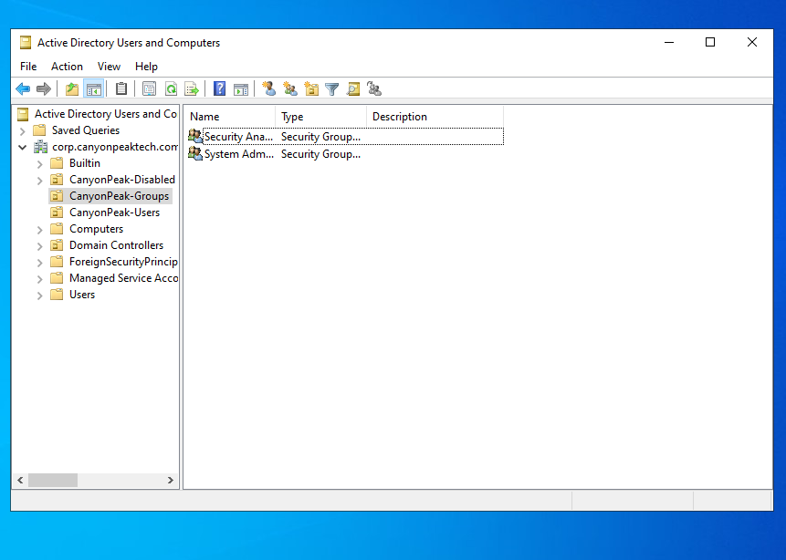
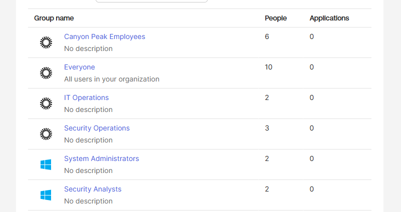
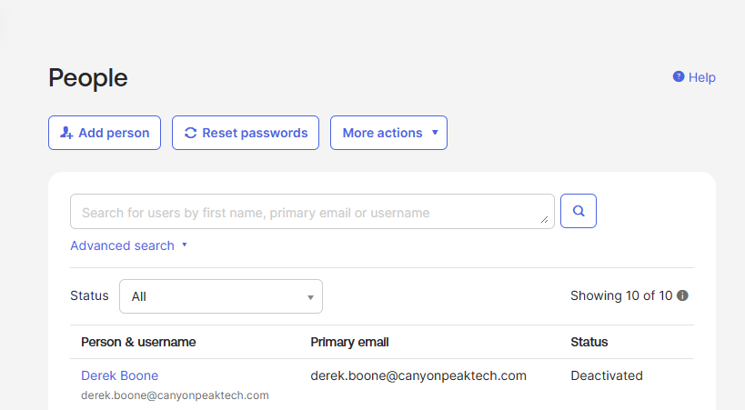

# Lab 03 — RBAC Design & Implementation

**Status:** Complete
**Scenario:** Building a least-privilege access model on top of the Lab 02 integration, onboarding two hires into it, catching an out-of-band access grant, and running a full AD-driven offboarding.

## Objective

Department groups describe the org chart; they don't describe access. This lab adds **role groups** — System Administrators and Security Analysts, the two job families access decisions actually hang off — as Active Directory security groups that sync into Okta. Then it stress-tests the model twice: once by manufacturing the kind of ad hoc app assignment that erodes RBAC in real environments and tracing it through the System Log, and once by offboarding an employee entirely from the AD side.

These are also the first AD groups to reach Okta. Lab 02 deliberately imported users only, so after this lab the tenant demonstrates **three different membership models side by side**:

| Group | Membership managed by | Why |
|---|---|---|
| Canyon Peak Contractors / Employees | Manual assignment in Okta | "Is an employee" is a fact about the employment relationship, not an attribute |
| IT Operations, Security Operations, Client Services, Finance | Okta group rules on `department` | Derivable from the profile, so it should never be maintained by hand |
| System Administrators, Security Analysts | AD security group membership, synced | Role assignment is an access decision made in the source-of-truth directory |

Knowing which model fits which kind of group — and being able to say why — is worth more than any single one of them.

## Prerequisites

- Labs 00–02 complete: agent healthy, four employees AD-sourced, delegated auth working
- The Lab 02 OU scoping in place (`canyonpeak-users` and `canyonpeak-groups` only — the leaver exercise depends on `canyonpeak-disabled` being *excluded*)

### Watch the user budget

Two hires arrive in this lab and one leaves: 7 active users → 9 → 8. Still under the 10-user cap, but this is the high-water mark until Lab 06.

## Environment & technologies

- Active Directory Users and Computers (ADUC)
- Okta Admin Console — Directory Integrations, Groups, System Log
- Okta System Log query syntax (`eventType eq "..."`)

---

## Steps

### 1. Create the role groups in AD

**ADUC → `CanyonPeak-Groups` → right-click → New → Group**, twice:

| Group name | Scope | Type |
|---|---|---|
| System Administrators | Global | Security |
| Security Analysts | Global | Security |

Add the existing employees to their roles: open each group → **Members tab → Add** — **Alex Rivera** into System Administrators, **Priya Nair** into Security Analysts. Marcus and Jordan hold no role group; not everyone does, and that's the point — role membership should mean something.

<details>
<summary>PowerShell equivalent</summary>

```powershell
$ou = "OU=CanyonPeak-Groups,DC=corp,DC=canyonpeaktech,DC=com"
New-ADGroup -Name "System Administrators" -GroupScope Global -GroupCategory Security -Path $ou
New-ADGroup -Name "Security Analysts"      -GroupScope Global -GroupCategory Security -Path $ou
Add-ADGroupMember -Identity "System Administrators" -Members alex.rivera
Add-ADGroupMember -Identity "Security Analysts"      -Members priya.nair
```
</details>



### 2. Onboard two hires into the model

Canyon Peak is growing. **ADUC → `CanyonPeak-Users` → New → User**, twice:

| First | Last | User logon name | UPN suffix | Department | Job title | Role group |
|---|---|---|---|---|---|---|
| Elena | Vasquez | `elena.vasquez` | `@canyonpeaktech.com` | IT Operations | Systems Administrator | System Administrators |
| Derek | Boone | `derek.boone` | `@canyonpeaktech.com` | Security Operations | Security Analyst | Security Analysts |

Same rules as Lab 02: the **short UPN suffix** from the drop-down, and `department` + title on the **Organization** tab — the department drives the Okta group rules, so set it before the import, not after.

Then add each to their role group in AD.

### 3. Import and watch all three membership models fire at once

**Directory → Directory Integrations →** your directory **→ Import tab → Import Now → Full Import** (full, not incremental — new *groups* are involved, and this guarantees everything is picked up in one pass). Confirm and auto-activate the two new users.

Now check **Directory → Groups**, because one import just exercised every model in the table above:

- **System Administrators** and **Security Analysts** appear for the first time — with the Active Directory icon. Open one: Elena is in it, and there's no way to edit membership from Okta. It's managed in AD, and the console says so.
- **IT Operations** gained Elena and **Security Operations** gained Derek — the Lab 01 group rules fired on their `department` values, same as they did for the Lab 02 staff.
- **Canyon Peak Employees** did *not* gain anyone. It's manual. Add Elena and Derek yourself: **Canyon Peak Employees → People → Assign People.**

That last one is friction, and it's worth feeling: the manual model means every joiner needs a human to remember this step, which is exactly why it doesn't scale past a small org and why Lab 06 automates the whole joiner flow.



### 4. Add a placeholder app as the sprawl target

The next step needs an application to mis-assign. **Applications → Applications → Browse App Catalog**, search for **SCIM 2.0 Test App (Header Auth)**, and add it with defaults — no provisioning config, no credentials. It exists purely as an assignment target; Lab 04 builds the real app portfolio.

Assign it properly first, the way the RBAC model says to: **Assignments → Assign to Groups → System Administrators.** Alex and Elena now have it, through their role. Nobody else does.

### 5. Manufacture the sprawl, then catch it

Now be the well-meaning admin who breaks the model. **Assignments → Assign → Assign to People → Jordan Lee.** Jordan is Finance — no role group, no business reason to hold this app. Ticket says grant it, someone grants it, ticket closes. That's how sprawl happens: one direct assignment at a time, each individually defensible.

Then catch it the way you would in an environment you'd inherited. **Reports → System Log**, and search:

```
eventType eq "application.user_membership.add"
```

Every app grant is there — the group-driven ones for Alex and Elena, and Jordan's direct one. Open Jordan's event and read the detail: the target chain shows the app and the user but **no group in the path**, which is the fingerprint of a direct assignment. On the app's own Assignments tab, the same distinction shows as the assignment type.

Remediate: **Assignments → find Jordan → X → confirm.** The app is back to being reachable only through the role group.

### 6. Offboard Derek — entirely from AD

Derek's pre-employment background check came back with a problem, and Canyon Peak's clients require clean checks for anyone touching their systems. He's out, effective immediately — three weeks after joining. Short-tenure exits like this are routine, and they're the sharpest test of an offboarding pipeline because nobody has muscle memory for this specific person yet.

Everything happens in ADUC. Okta doesn't get touched:

1. Right-click **Derek Boone → Disable Account**
2. Open his **Member Of** tab → remove **Security Analysts** and everything else except Domain Users
3. Right-click → **Move** → into `CanyonPeak-Disabled`

Run an **Incremental Import** in Okta. Then check **Directory → People**: Derek is **Deactivated**, holds no groups, and has no app access — driven entirely by directory-side changes.

Two independent mechanisms just fired, and it's worth being able to name both. The **disabled flag** syncs as deactivation — that alone kills his access. And the **OU move** took him out of the agent's import scope entirely, because Lab 02 deliberately left `canyonpeak-disabled` unscoped — so Okta stops seeing him at all on future imports. Belt and suspenders, and the belt works even if someone forgets the suspenders.

Note what deactivation is *not*: deletion. His account, his System Log history, and the audit trail of everything he touched all remain. Deactivated users also don't count against the 10-user cap — the slot comes back.



---

## Verification

- [ ] System Administrators and Security Analysts exist in AD and in Okta, AD-sourced, with membership uneditable in Okta
- [ ] Elena and Derek imported with correct departments; group rules placed them automatically
- [ ] Elena and Derek manually added to Canyon Peak Employees
- [ ] SCIM test app assigned to System Administrators only; Alex and Elena hold it via the group
- [ ] Jordan's direct assignment found via `application.user_membership.add` in the System Log, then removed
- [ ] Derek shows Deactivated in Okta with zero groups, after AD-only changes
- [ ] Derek's account sits disabled in `CanyonPeak-Disabled`
- [ ] Active user count is 8 of 10

## Notes

The offboarding actually fires two independent mechanisms, and it's worth knowing you have both: the disabled flag syncs as deactivation, and the OU move takes the account out of the agent's import scope entirely — which only works because Lab 02 deliberately left `canyonpeak-disabled` unscoped. Either alone would have cut his access; together, one covers for the other being forgotten.

## Key takeaways

The tenant now runs three membership models side by side, and each is the right tool for exactly one kind of group. Population groups (Employees, Contractors) are manual because "is an employee" is a fact about a contract, not derivable from any attribute. Department groups are rule-driven because they *are* derivable, so maintaining them by hand just means drift. Role groups live in AD because role assignment is an access decision, and access decisions belong in the source-of-truth directory where the JML process already operates. Picking the wrong model is how orgs end up with a rule fighting a manual override, or a "role" group nobody remembers the criteria for.

---

⬅ [Lab 02 — Active Directory Integration](../02-ad-integration) | [Lab 04 — SAML SSO Application Integration ➡](../04-saml-sso)
