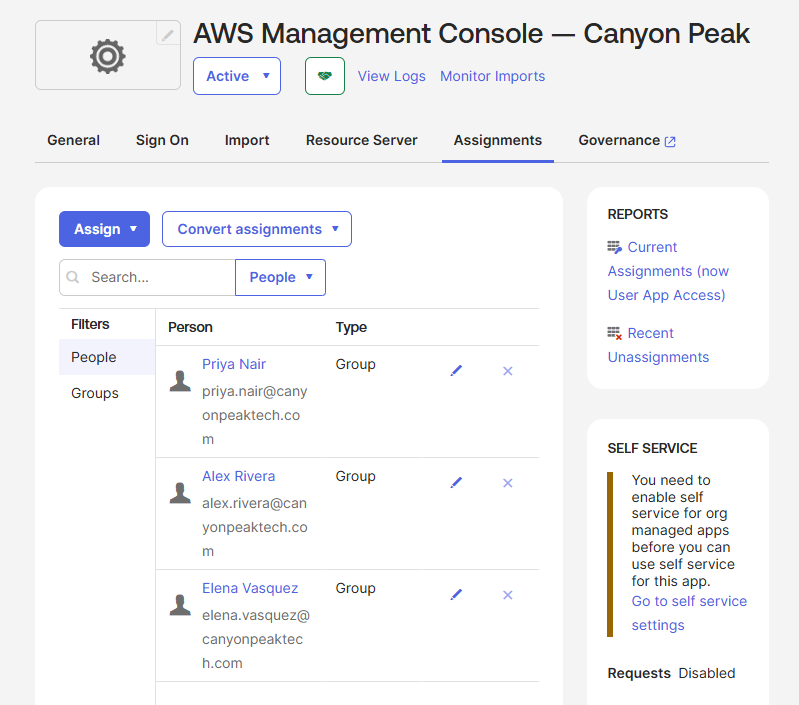

# Lab 04 — SAML SSO Application Integration

**Status:** Complete
**Scenario:** Building Canyon Peak's application portfolio as custom SAML 2.0 integrations, with access gated entirely through groups — and each tier of the portfolio driven by a different membership model.

## Objective

Three applications, three sensitivity levels, and — deliberately — three different answers to "who gets this and why":

| App | Purpose | Assigned to | Membership model behind it |
|---|---|---|---|
| Freshservice PSA | Ticketing — the whole company | Canyon Peak Employees **and** Canyon Peak Contractors | Manual population groups |
| Confluence Wiki | Internal technical docs | IT Operations, Security Operations | Rule-driven department groups |
| AWS Management Console | Cloud infrastructure | System Administrators, Security Analysts | AD-synced role groups |

That's the Lab 03 table put to work: population membership grants the universal tool, a profile attribute grants the departmental tool, and an access decision made in Active Directory grants the sensitive one. No application is ever assigned to an individual. When someone joins, moves, or leaves, their app access changes because their *group* memberships change — which is the entire argument for the pipeline built in Labs 01–03.

The SAML integrations themselves use placeholder Service Provider endpoints. There's no real Freshservice tenant on the other end, and there doesn't need to be — the trust configuration, the assignment model, and the resulting user experience are all real. (Application Setup is 10% of the OCP exam; the assignment model is the part that bleeds into the 26% Account Management domain.)

## Prerequisites

- Labs 01–03 complete: both populations in place, department rules firing, role groups synced from AD
- Current role membership: System Administrators = Alex, Elena; Security Analysts = Priya (Derek is deactivated — his slot in the model simply has nobody in it, which is fine)
- Dana and Alex enrolled in Okta Verify — they're the two dashboard test subjects in step 5

No new users this lab. The budget stays at 8 of 10.

## Environment & technologies

- Okta Admin Console — App Integration Wizard (SAML 2.0), Application Assignments
- Okta Universal Directory groups from all three membership models

---

## Steps

### 1. Create the Freshservice integration

**Applications → Applications → Create App Integration → SAML 2.0 → Next.**

**General Settings:** App name `Freshservice PSA — Canyon Peak`. → **Next.**

**Configure SAML:**

| Field | Value |
|---|---|
| Single Sign-On URL | `https://canyonpeak.freshservice.example/saml/acs` |
| Audience URI (SP Entity ID) | `https://canyonpeak.freshservice.example/saml/metadata` |
| Name ID format | EmailAddress |
| Application username | Email |

**→ Next.** On the Feedback page, tick **This is an internal app that we have created** → **Finish.**

The `.example` domain is deliberate — it's reserved for exactly this, can never resolve to a real host, and makes it obvious in every screenshot that the SP side is a stand-in.

### 2. Assign it to the whole company — which takes two groups

**Assignments tab → Assign → Assign to Groups**: assign **Canyon Peak Employees**, then **Canyon Peak Contractors**. → Done.

Two assignments, because "the whole company" is two populations. The tempting shortcut is Okta's built-in **Everyone** group — one assignment, job done. Don't: Everyone means *every account in the org*, including your admin account, any future JIT-created stragglers, and anything else that ever gets provisioned. The two explicit population groups say precisely who the company is, and the day a third population appears (interns, a client's embedded team), it gets an explicit decision instead of silent inclusion.

### 3. Confluence, gated by department

Repeat step 1 with:

| Field | Value |
|---|---|
| App name | `Confluence Wiki — Canyon Peak` |
| Single Sign-On URL | `https://canyonpeak.confluence.example/saml/acs` |
| Audience URI | `https://canyonpeak.confluence.example/saml/metadata` |

Assign to **IT Operations** and **Security Operations**.

Now notice who that catches: Alex, Elena, Priya — and **Dana**, the contract security auditor, whose `department` is Security Operations. The department rule put her in that group in Lab 01, and the group just granted her the wiki. Is that right? Arguably yes — an auditor plausibly needs the docs. But nobody *decided* it; an attribute did. That's the trade hiding inside rule-driven access: it can't tell an employee from a contractor, because the rule only sees the profile. Sit with that one; it's a Key takeaways question, and Lab 05 partially answers it by treating contractors differently at the policy layer instead.

### 4. AWS Console, gated by role

Repeat again:

| Field | Value |
|---|---|
| App name | `AWS Management Console — Canyon Peak` |
| Single Sign-On URL | `https://canyonpeak.aws.example/saml/acs` |
| Audience URI | `https://canyonpeak.aws.example/saml/metadata` |

Assign to **System Administrators** and **Security Analysts** — the AD-synced role groups. Three people hold this app: Alex, Elena, Priya. Nobody gets it from an org-chart attribute; membership is an access decision made in ADUC, synced in, and revocable the same way. This is the most sensitive app in the portfolio, and in Lab 05 it gets step-up authentication on top.

### 5. Verify from both sides

**Admin side first — every user, no sign-ins needed.** For each person, **Directory → People → (user) → Applications tab** shows their effective app list. Check the matrix:

| User | Freshservice | Confluence | AWS |
|---|---|---|---|
| Alex Rivera | ✓ | ✓ | ✓ |
| Elena Vasquez | ✓ | ✓ | ✓ |
| Priya Nair | ✓ | ✓ | ✓ |
| Marcus Webb | ✓ | — | — |
| Jordan Lee | ✓ | — | — |
| Dana Whitfield | ✓ | ✓ | — |
| Theo Marsh | ✓ | — | — |

**Then the real thing, from the two users who can already pass MFA.** In a private window, sign in as **Dana**: Freshservice and Confluence tiles, no AWS. Then as **Alex** (his AD password — delegated auth): all three tiles. Don't sign in as the others — they've never enrolled Okta Verify, and enrolling four more people on one phone to look at tiles proves nothing new.

### 6. Optional cleanup

The **SCIM 2.0 Test App** from Lab 03 has served its purpose as the sprawl target. Deactivate it (**Applications → SCIM 2.0 Test App → More → Deactivate**) so the portfolio contains only intentional apps — or keep it if you'd rather preserve the Lab 03 state. Deactivating an app removes its assignments but keeps its System Log history, same logic as deactivated users.

---

## Verification

- [ ] Three SAML 2.0 app integrations exist, each with distinct `.example` SP endpoints
- [ ] Freshservice assigned to both population groups; no use of Everyone
- [ ] Confluence assigned to the two department groups; Dana holds it via the Security Operations rule
- [ ] AWS assigned to the two AD role groups; exactly Alex, Elena, Priya hold it
- [ ] No application has any individual (person-level) assignment
- [ ] Per-user Applications tabs match the access matrix
- [ ] Dana's dashboard shows two tiles; Alex's shows three

---

⬅ [Lab 03 — RBAC Design & Implementation](../03-rbac-design) | [Lab 05 — MFA & Adaptive Authentication ➡](../05-mfa-adaptive-auth)
