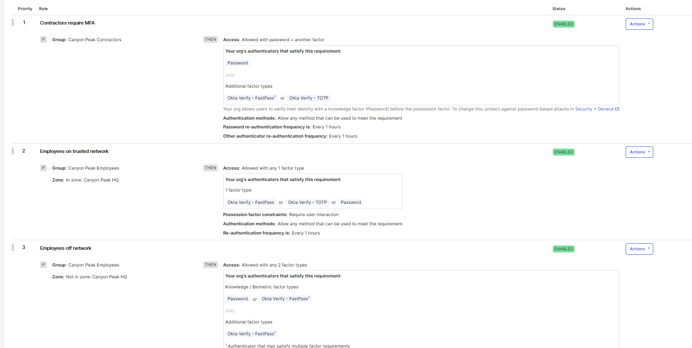
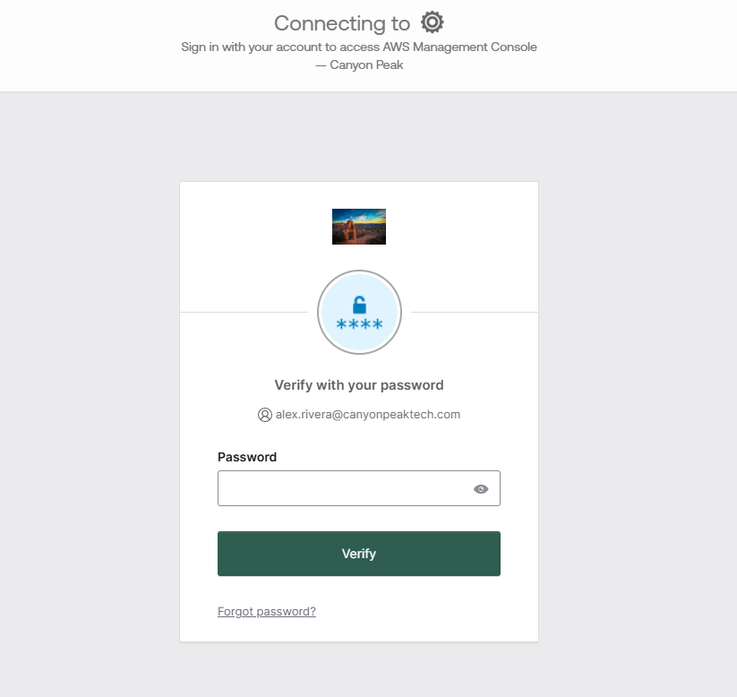

# Lab 05 — MFA & Adaptive Authentication

**Status:** Not started
**Scenario:** Making authentication requirements proportional to risk — network-aware policy for the general portfolio, step-up for AWS, and enrollment standards that stop weak factors from ever satisfying any of it.

## Objective

This is the largest domain on the OCP exam — Security Enforcement, 38% — and it gets the most careful lab in the series. By the end, the three Lab 04 apps carry three different authentication postures:

| App | Policy | Behaviour |
|---|---|---|
| Freshservice, Confluence | `Standard Access Policy`, extended with network-aware rules | 1 factor on the trusted network, password + Okta Verify off it; contractors always 2 factors |
| AWS Console | New `High Assurance Policy` | Password + Okta Verify **every single access**, active session or not |

Underneath both, a new employee enrollment policy makes Okta Verify mandatory and removes email as an enrollable factor — closing the classic gap where careful sign-in policy sits on top of recovery-grade factors.

**Two facts learned the hard way in Labs 01–02 do a lot of work here; keep them in view.** An app belongs to exactly one authentication policy — assigning it to a new one silently removes it from the old, by design. And enrollment policy governs what a user may *hold* while authentication policy governs what they must *prove*; when they disagree, authentication wins and compels enrollment.

## Prerequisites

- Labs 01–04 complete: both populations, the app portfolio with its group assignments, Alex and Dana enrolled in Okta Verify
- A way to reach your org from a different public IP for the off-network test — a phone hotspot is the practical answer
- No new users; budget stays at 8 of 10

## Environment & technologies

- Okta Authenticators and Enrollment Policies
- Okta Authentication Policies (App Sign-In), Network Zones
- Okta System Log (`policy.evaluate_sign_on`)

### A note on testing against fake Service Providers

Every app-access test in this lab ends the same way: Okta evaluates the policy, issues any challenge, generates the SAML response — and then the browser dies trying to reach `canyonpeak.*.example`, because the SP is a placeholder. **That error page is expected and means nothing failed.** Everything this lab tests happens *before* the redirect: the challenge (or its absence) is the result. Note it once here so no step reads as broken.

---

## Steps

### 1. Confirm the authenticator baseline

**Security → Authenticators → Setup tab.** Okta Verify should be Active (it's enforced by the dashboard policy already, so it must be). Note what else is active — **Email** almost certainly is, and it's the factor step 5 exists to get rid of. Password everywhere, obviously.

### 2. Define the network zones

**Security → Networks → Add Zone → IP Zone**, twice:

| Zone | Configuration |
|---|---|
| `Canyon Peak HQ` | Gateway IPs: your current public IP, `/32` — the stand-in for an office egress point |
| `Blocked Region` | Tick *Block access from IPs matching…*; Gateway IPs: `203.0.113.0/24` — a documentation range standing in for an embargoed geography |

Find your public IP by searching "what is my IP" — note that the VM shares it, since VMware NAT egresses through your host.

Zones do nothing by themselves; they're conditions waiting to be referenced. The blocked zone takes effect org-wide immediately though — Okta evaluates blocked zones before policy — so don't put any range you actually use in it.

### 3. Make the standard policy network-aware

**Security → Authentication Policies → Standard Access Policy.** Its current shape, from Lab 01: `Contractors require MFA` above a password-only catch-all. Contractors keep their rule — third parties on unmanaged equipment don't get a network discount. The new rules slot in below it, above the catch-all:

**Rule: `Employees on trusted network`**

| Field | Value |
|---|---|
| IF User's group membership includes | Canyon Peak Employees |
| AND User's IP is | In zone → `Canyon Peak HQ` |
| THEN Access is | Allowed after successful authentication |
| AND User must authenticate with | Any 1 factor type |

**Rule: `Employees off network`**

| Field | Value |
|---|---|
| IF User's group membership includes | Canyon Peak Employees |
| AND User's IP is | Not in zone → `Canyon Peak HQ` |
| THEN Access is | Allowed after successful authentication |
| AND User must authenticate with | Password + Another factor |

Leave possession factor constraints unchecked on both — same reasoning as Lab 01, nobody holds a phishing-resistant factor yet.

Check the final rule order top to bottom: contractor rule, on-network employees, off-network employees, catch-all. First match wins; the contractor rule sitting first is what stops a contractor on your home network from inheriting the employee discount.

Now assign the apps: **Applications tab (within the policy) → Add app → Freshservice and Confluence.** Both were on their default policy until now — this is the one-policy-per-app move, silent and expected.

### 4. Step-up authentication for AWS

**Create Policy:** `High Assurance Policy` — *Re-authentication required for infrastructure access.* One rule above its catch-all:

| Field | Value |
|---|---|
| Rule name | `Step-up every access` |
| IF User's IP is | Any IP |
| THEN Access is | Allowed after successful authentication |
| AND User must authenticate with | Password + Another factor |
| AND Prompt for authentication | **Every time user accesses the resource** |
| AND Possession factor constraints are | **Untick Phishing resistant** — the rule editor may arrive with it pre-ticked. After saving, read the rule card: it must list FastPass *or TOTP* as satisfying factors. FastPass alone means the constraint is on and nobody in this org can open the app. |

That last setting is the step-up: an existing session, even one that satisfied two factors an hour ago, is not good enough for this app. Set the catch-all to the same requirement — for a policy like this, the floor and the rule should agree.

Assign the **AWS Management Console** app to this policy.

**Test it as Alex, mid-session.** Sign in to the dashboard as Alex (AD password + Okta Verify), open Freshservice — no new challenge, session's good — then click AWS: **fresh password and Okta Verify prompt, despite the active session.** Then the dead redirect, which you now expect. That mid-session re-challenge is the behaviour the whole policy exists for.

### 5. Employee enrollment policy — kill the email factor

The contractors got an enrollment policy in Lab 01; employees have been riding the org default, which allows email enrollment. Email is a recovery channel wearing an authenticator costume — anyone who owns the mailbox owns the factor — and nothing in steps 3–4 stops a user from *satisfying* "another factor" with it if it's enrollable.

**Security → Authenticators → Enrollment tab → Add a Policy:**

| Field | Value |
|---|---|
| Policy name | `Canyon Peak Employee Enrollment` |
| Assign to groups | Canyon Peak Employees |
| Okta Verify | **Required** |
| Password | Required |
| Email | **Disabled** |

Add its rule (enrollment allowed anywhere), save, and confirm the policy sits **above** the Default Policy in the list — enrollment policies are priority-ordered like everything else.

**Verify with Marcus, without enrolling him.** Marcus has never enrolled anything. Sign in as him (AD password) — the enrollment screen appears, and the thing to look at is what it *offers*: Okta Verify required, **no email option anywhere**. That screen is the policy working. Capture it and back out; completing the enrollment proves nothing further, and four accounts on one phone is already plenty.

### 6. The off-network test

Steps 3's rules have only been exercised from the trusted zone so far. Now leave it: put your phone on hotspot, connect a device (or tether the laptop), and sign in to the dashboard as **Dana**, then as **Alex**.

- Dana, off-network: contractor rule — password + Okta Verify, same as always.
- Alex, off-network: the `Employees off network` rule — password + Okta Verify, where on your home network he'd have matched the 1-factor rule.

Then check the receipts: **Reports → System Log**, search `eventType eq "policy.evaluate_sign_on"`. Each evaluation names the policy and the rule that matched — the off-network events show `Employees off network` where the at-home ones show `Employees on trusted network`. That per-event rule attribution is also your first diagnostic stop whenever a policy behaves unexpectedly, which — per Labs 01 and 02 — is a matter of when, not if.

📸 *Screenshot: two `policy.evaluate_sign_on` events for the same user matching different rules from different networks.*

### 7. Optional: FastPass and passwordless

Okta Verify FastPass can satisfy both factor types at once — possession plus device biometric — which is what "passwordless" concretely means in Okta: rules satisfied without the password ever being typed. Enabling it (**Authenticators → Okta Verify → Actions → Edit → FastPass**) is one toggle, but *experiencing* it requires device registration through Okta Verify, and the payoff on a lab tenant is modest. Worth doing if you're curious; worth skipping if you're moving — but either way, be able to say what FastPass is, because "how would you go passwordless" is a fair interview question and the answer is this feature plus the phishing-resistant possession constraint from Lab 01.

---

## Verification

- [ ] Both zones exist; the HQ zone holds the current public IP
- [ ] Standard Access Policy: contractor rule, then on-network, then off-network, then catch-all — in that order
- [ ] Freshservice and Confluence assigned to Standard Access; AWS to High Assurance; nothing on defaults
- [ ] Alex mid-session: Freshservice opens silently, AWS re-challenges
- [ ] Marcus's enrollment screen offers Okta Verify and no email
- [ ] Off-network sign-ins match the off-network rule, confirmed via `policy.evaluate_sign_on` events
- [ ] Employee enrollment policy priority sits above Default

## Before you commit screenshots

**Your public IP appears in the Networks page and possibly in System Log event detail. Blur it everywhere.** It's the single most identifying artifact this series produces — a `/32` in a zone called HQ is your house. Everything else here is lab-fictional or a documentation range.

## Notes

_(fill in as completed — zone evaluation surprises, rule-ordering mistakes caught, what the System Log showed)_

## Key takeaways

_(fill in once complete. Worth thinking about: why the contractor rule must sit above the network rules, and what a contractor on your home Wi-Fi would get if it didn't; what step-up actually protects against that session-length MFA doesn't; why email-as-factor undermines every policy above it, and where else recovery channels masquerade as authenticators; and what `policy.evaluate_sign_on` gives you that no policy screen can — the Lab 02 lesson, now applied to policy instead of credentials.)_

---

⬅ [Lab 04 — SAML SSO Application Integration](../04-saml-sso) | [Lab 06 — JML Lifecycle Automation ➡](../06-jml-automation)
