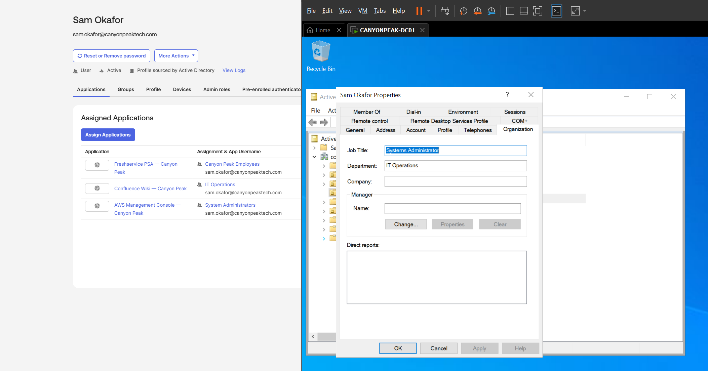
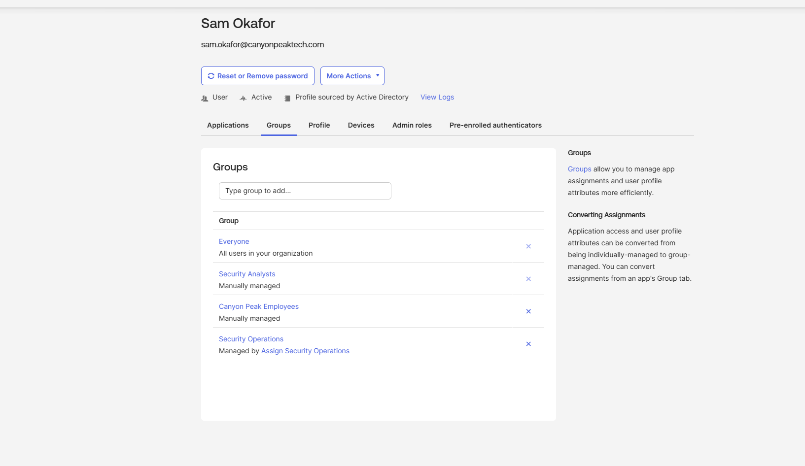

# Lab 06 — JML Lifecycle Management

**Status:** Complete
**Scenario:** Sam Okafor's entire tenure at Canyon Peak — hired, moved across teams, and departed — processed through ADUC, with every downstream change in Okta happening by propagation.

## Objective

Run a complete joiner–mover–leaver cycle, plus a three-event batch of the kind an HR feed would deliver, using the tools a Windows administrator actually lives in: Active Directory Users and Computers on the domain controller, with the Okta Admin Console used for verification only.

The point being proven is the pipeline, not the clicking. Every mechanism built across Labs 01–05 fires on its own — group rules react to attribute edits, role membership syncs, app access follows groups, deactivation propagates — because none of it ever depended on *how* the AD change was made. The admin's job collapses to making the right change in one system and confirming the cascade.

**The mover encodes the series' central distinction.** A *department* change is an attribute edit — Okta's group rules see the new value on import and move the user between department groups untouched. A *role* change is an AD group membership change — synced in, app access follows. A real move is usually both, and knowing which mechanism handles which half is the difference between operating this pipeline and merely using it.

## Prerequisites

- Labs 00–05 complete; agent healthy
- ADUC on the domain controller

Optional but worth it: run ADUC as the automation account rather than Administrator — `runas /user:CANYONPEAK\svc-labautomation "mmc dsa.msc"` — so the delegated permissions from Lab 00 get exercised rather than bypassed. An access-denied error in that session is the delegation being tested, not broken.

### Watch the user budget

| Event | Active users |
|---|---|
| Start | 8 |
| Sam joins | 9 |
| Sam leaves | 8 |
| Taylor joins | 9 |
| Marcus leaves | 8 |

Peak of 9 — the cap survives the whole lab.

---

## Steps

### 1. Joiner — Sam Okafor

**ADUC → `CanyonPeak-Users` → right-click → New → User:**

| Field | Value |
|---|---|
| First / Last | Sam Okafor |
| User logon name | `sam.okafor` @ **`canyonpeaktech.com`** (the short suffix, from the drop-down) |
| Password | Temporary, *User must change password at next logon* ticked |

After creation, open his **Properties → Organization** tab: Department `IT Operations`, Job title `Systems Administrator`. Then **Member Of → Add → System Administrators**.

Run an **Incremental Import** in Okta, confirm Sam, then verify the cascade: IT Operations group (rule fired on the attribute), System Administrators group (AD sync), and — via those — Freshservice, Confluence, and AWS on his Applications tab. One user created, one import, and Lab 04's entire access matrix applied itself. Finally, add him to **Canyon Peak Employees** in Okta — the manual population group, manual by design since Lab 01.

Count the surfaces just touched: the user wizard, the suffix drop-down, the password flags, the Organization tab, Member Of, and the Okta-side add. Six chances to skip something, and nothing checks that you didn't — the process lives in the operator's memory, which is another way of saying it isn't a process yet.

### 2. Mover — Sam crosses to the security team

Two months in, Sam moves to Security Operations as an analyst. Two changes, two different tabs, two different mechanisms:

1. **Properties → Organization**: Department → `Security Operations`, Job title → `Security Analyst` — the *attribute* half; Okta's group rules move him between department groups on import.
2. **Member Of**: remove `System Administrators`, add `Security Analysts` — the *membership* half; sync carries it directly.

Import, then trace each half to its mechanism in Okta: IT Operations lost him and Security Operations gained him *because a rule reacted*; the role groups change *because AD says so*. His app list survives the move — both role groups carry AWS — but the reason he holds AWS changed. The System Log has the group churn if you want receipts. (Full disclosure: my own run took the console's convenient path on the membership half — I added Security Analysts to Sam directly in Okta, which is why his Groups tab reads *Manually managed* in the screenshot below. The AD-side change is the model's way; shortcuts like mine are exactly how source-of-truth drift starts, so it stays documented rather than reshot.)

### 3. Leaver — Sam departs

A recruiter got him. Two months of tenure, and the offboarding is the same three actions performed on Derek in Lab 03:

1. Right-click **Sam Okafor → Disable Account**
2. **Member Of** → remove everything except Domain Users
3. Right-click → **Move** → `CanyonPeak-Disabled`

Import; verify Deactivated, zero groups, and Okta System — not you — stripping his app memberships as deactivation propagates.

Note the ordering you're holding in your head: disable *first*, so no window exists where a moved-but-active account lingers. Nothing in ADUC enforces that sequence. It's a runbook that lives in memory — which works until the urgent 5pm termination where memory is exactly what's compromised.

### 4. The batch — three events, back to back

Real lifecycle events arrive in batches from HR, not one at a time. Process one of each, serially:

1. **Join Taylor Brooks** — the full step 1 procedure again: wizard, suffix, password flags, Organization tab (`Client Services` / `Support Technician`), no role group, import, manual Okta population add.
2. **Move Elena Vasquez** — Member Of only: remove `System Administrators`, add `Security Analysts`. A role-only move; no attribute touched.
3. **Leave Marcus Webb** — the three-action offboarding, disable first, again.

One **Full Import** at the end; verify all three outcomes: Taylor active with Freshservice only, Elena holding AWS via her new role group, Marcus deactivated with nothing.

Time yourself honestly across these three. Then imagine Monday morning delivering thirty. That number is the strongest argument for the automation this lab deliberately doesn't build — see the scope note below.

---

## Verification

- [ ] Sam's join cascaded through both group models and all three apps with no Okta-side configuration
- [ ] Sam's move: department groups changed via rule, role groups via sync — and you can say which was which
- [ ] Sam's offboarding matches Derek's Lab 03 end state
- [ ] Taylor is active with Freshservice; Elena holds AWS via Security Analysts; Marcus is deactivated
- [ ] Every offboarding performed disable-first
- [ ] Active user count ends at 8 of 10
---

⬅ [Lab 05 — MFA & Adaptive Authentication](../05-mfa-adaptive-auth) | [Series overview](../..)
